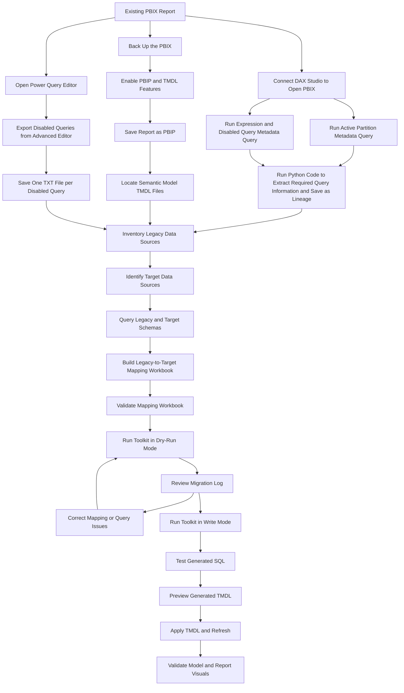

# Power BI Migration Toolkit

A mapping-driven Python toolkit for migrating Power BI semantic models, Power Query M, native SQL, data sources, tables, columns, and data types from legacy to target schemas.

The toolkit updates physical source references while preserving the Power BI semantic model structure used by DAX, relationships, calculations, formatting, summarization, and report visuals.

## The Problem

Migrating a Power BI solution involves more than replacing a server, database, schema, or table name.

Source references can appear across:

- TMDL table definitions
- Power Query M expressions
- Native SQL queries
- Nested SQL subqueries
- SQL aliases and derived tables
- Join conditions
- Expanded and renamed columns
- Data type transformations
- Disabled Power Query queries
- TMDL `sourceColumn` properties
- Calculated columns and DAX dependencies

Physical database names and Power BI model names often serve different purposes.

For example:

```sql
source.[Location_Code] AS [Location]
```

In this expression:

- `Location_Code` is the target physical database column.
- `Location` is the query output expected by Power Query.
- The semantic model may also expose the column as `Location`.

Changing the physical field is necessary.

Changing the output alias may break:

- DAX calculations
- Relationships
- Report visuals
- Sort-by-column settings
- Summarization settings
- Calculated columns
- Power Query transformations

Nested SQL introduces another challenge:

```sql
LEFT JOIN
(
    SELECT
        source.[Target_Column] AS [Report Mapping]
    FROM target_schema.target_view AS source
) AS mapping_result
```

Inside the subquery, SQL must use the physical alias:

```sql
source.[Target_Column]
```

Outside the subquery, SQL must use the derived-table alias and its published output:

```sql
mapping_result.[Report Mapping]
```

Treating physical aliases, derived aliases, and output aliases as interchangeable can produce invalid SQL.

## The Solution

Power BI Migration Toolkit uses a validated Excel mapping workbook as the source of truth for migrating:

```text
Legacy schema and table  -> Target schema and table
Legacy column            -> Target column
Legacy data type         -> Target data type
```

The toolkit applies mappings within the correct table and query scope.

It changes physical source references while preserving the established outputs expected by:

- Power Query
- TMDL
- DAX
- Relationships
- Calculated columns
- Dashboard visuals

## End-to-End Workflow



# Prerequisites

Complete the following preparation steps before running the migration toolkit.

## 1. Back Up the Power BI Report

Create a backup copy of the original `.pbix` file.

The migration should be performed against a working copy so the original report remains available for comparison and recovery.

Do not overwrite the only copy of the original report.

## 2. Enable Power BI Project Format

The toolkit processes the text-based Power BI Project structure.

In Power BI Desktop:

1. Open the `.pbix` file.
2. Select **File**.
3. Select **Options and settings**.
4. Select **Options**.
5. Open **Preview features**.
6. Enable the Power BI Project `.pbip` save option if the option is available in the installed version.
7. Restart Power BI Desktop if prompted.

Power BI Project format saves report and semantic model definitions as individual files in a folder structure. This supports source control and programmatic editing.

## 3. Activate TMDL Script

On your pbix file, navigate to TMDL tab -> hit space bar on the script tab to clear out the place holder script. This creates a tab called Script1.

## 4. Save the PBIX as a PBIP Project

After enabling the required features:

1. Select **File**.
2. Select **Save as**.
3. Choose **Power BI Project** as the file format.
4. Save the project in a new folder.

A typical project structure is:

```text
PowerBIProject/
├── ReportName.pbip
├── ReportName.Report/
└── ReportName.SemanticModel/
    └── definition/
        ├── model.tmdl
        ├── relationships.tmdl
        ├── expressions.tmdl
        └── tables/
            ├── Table1.tmdl
            ├── Table2.tmdl
            └── Table3.tmdl
```

The toolkit uses this folder as its TMDL input:

```text
ReportName.SemanticModel\definition\tables
```

## 5. Review the TMDL Table Files

Confirm that each physical model table has a corresponding `.tmdl` file.

A table definition can contain:

```text
Table metadata
Physical columns
Calculated columns
Measures
Formatting
Summarization
Lineage tags
Power Query partition definitions
Native SQL
Annotations
```

Do not edit/remove these settings.

The toolkit is designed to preserve semantic model metadata while changing physical data-source references.

# Capture Partition and Query Metadata with DAX Studio

## 6. Open the PBIX in Power BI Desktop

Keep the original or working `.pbix` file open in Power BI Desktop.

The semantic model must be running before DAX Studio can connect to it.

## 7. Connect DAX Studio

Open DAX Studio and connect to the open Power BI Desktop model.

DAX Studio exposes model metadata and available Dynamic Management Views. The DMV list can be used to insert a basic query into the query editor. 

DMVs return information about model objects and server state in a table format that can be copied or exported.

## 8. Capture Active Partition Metadata

Run a partition metadata query to identify loaded semantic model tables and their partition expressions.

A common starting query is:

```sql
SELECT
    *
FROM
    $SYSTEM.TMSCHEMA_PARTITIONS
```

The partition metadata can include the partition name, table reference, source type, and query definition.

Export the results to a file for analysis.

Suggested filename:

```text
active_partitions.csv
```

The extraction should capture enough information to identify:

```text
Table name
Partition name
Partition mode
M query definition
Native SQL
Referenced schema and table
```

## 9. Capture Query and Expression Metadata

Run a second metadata query for model expressions and Power Query definitions.

Query to capture active connections:

```sql
SELECT
    'Data Load Enabled ' AS ObjectType,
    [Name],
    [QueryDefinition] AS QueryDefinition
FROM $SYSTEM.TMSCHEMA_PARTITIONS
```
Query to capture inactive/disabled connections:

```sql
SELECT
    'Data Load Disabled' AS ObjectType,
    [Name],
    [Expression] AS QueryDefinition
FROM $SYSTEM.TMSCHEMA_EXPRESSIONS
```

Export the results to a separate file.

Suggested filename:

```text
model_expressions.csv
```

The purpose of the two metadata extracts is to capture:

```text
Active loaded partitions
Shared Power Query expressions
Connection expressions
Queries not directly represented as loaded table partitions
```

## 10. Review the DAX Studio Output

Use the partition and expression extracts to identify:

- Legacy servers
- Legacy databases
- Legacy schemas
- Legacy tables
- Legacy views
- Native SQL queries
- Power Query dependencies
- Shared expressions
- Queries referenced by other queries

These extracts provide the initial inventory for mapping legacy sources to target sources.

# Export Disabled Power Query Queries

## 11. Open Power Query Editor

In Power BI Desktop:

1. Select **Transform data**.
2. Review the Queries pane.
3. Identify queries where **Enable load** is turned off.

Disabled queries can still support loaded queries through references, merges, appends, functions, and staging logic.

They must be included in the migration inventory even though they do not have standalone loaded TMDL table definitions.

## 12. Open the Advanced Editor

For each disabled query:

1. Select the query in the Queries pane.
2. Open **Advanced Editor**.
3. Copy the complete M expression.
4. Preserve the exact query name shown in Power Query.

The Power Query Editor provides the interface for adding, modifying, grouping, and managing queries and query steps.

## 13. Save Each Disabled Query as a TXT File

Create one `.txt` file per disabled query.

The filename must exactly match the Power Query query name.

Example query names:

```text
SalesID
IndexFile
Location
SaleDate
```

Save them as:

```text
DisabledQueries/
├── SalesID.txt
├── IndexFile.txt
├── Location.txt
└── SaleDate.txt
```

Each file should contain only the complete M expression copied from Advanced Editor.

Example:

```powerquery
let
    Source =
        Sql.Database(
            "legacy-server",
            "legacy-database"
        ),

    Navigation =
        Source{
            [
                Schema = "legacy_schema",
                Item = "legacy_table"
            ]
        }[Data]
in
    Navigation
```

## Why the TXT Filename Matters

The toolkit uses the `.txt` filename as the Power Query query name.

For example:

```powerquery
Table.NestedJoin(
    SalesID,
    {"SalesFact"},
    IndexFile,
    {"ReportKey"},
    "Location",
    JoinKind.Inner
)
```

The toolkit resolves:

```text
SalesID
```

through:

```text
SalesFact.txt
```

and resolves:

```text
ReportKey
```

through:

```text
IndexFile.txt
```

This allows the toolkit to determine:

- Which physical table supplies the left side of a join
- Which physical table supplies the right side
- Which table mapping applies to each join key
- Which mapping applies to expanded columns
- Which target columns should be used downstream

Do not rename the `.txt` files to simplified filenames.

## Disabled Query Folder

The disabled-query folder is passed to the toolkit using:

```text
--disabled-query-folder
```

Example:

```powershell
--disabled-query-folder "C:\PowerBI\Migration\DisabledQueries"
```

The toolkit reads the `.txt` files, builds query dependency context, and generates migrated `_target.txt` or `_legacy.txt` outputs in the configured workflow.

# Discover Legacy Data Sources

## 14. Consolidate the Source Inventory

Use all available metadata sources:

```text
TMDL table files
DAX Studio partition export
DAX Studio expression export
Disabled query TXT files
Power Query Advanced Editor
Native SQL embedded in Sql.Database
```

Create a consolidated list of legacy objects:

```text
Legacy server
Legacy database
Legacy schema
Legacy table or view
Legacy column
Legacy data type
Power BI query
Power BI table
```

## 15. Identify Target Data Sources

For each legacy table or view, identify the corresponding target object.

The target inventory should include:

```text
Target server
Target database
Target schema
Target table or view
Target column
Target data type
```

Do not rely only on similar object names.

Confirm each target object using:

- Data platform documentation
- Approved migration specifications
- Data engineering guidance
- Source-to-target mapping documentation
- Database metadata queries

# Query Legacy and Target Metadata

## 16. Extract Legacy & Target Schema Metadata

Run a metadata query in the database.

Export or copy the results.(Use code in the repo)

Use the results to identify:

```text
Legacy Table
Legacy Type
Legacy Column
Target Table
Target Type
Target Column
```

# Build the Mapping Workbook

## 17. Create the Excel Mapping File

Create an Excel workbook with a worksheet named:

```text
Column Mapping
```

The toolkit expects these columns:

```text
Legacy Table
Legacy Type
Legacy Column
Target Table
Target Type
Target Column
```

## 18. Mapping Workbook Rules

Each mapping row should represent one approved source-to-target relationship.

Use fully qualified table names:

```text
schema.table
```

Do not enter only:

```text
table
```

unless the toolkit configuration and the source environment guarantee that table names are unique across schemas.

Column mappings are table-scoped.

These are separate mappings:

```text
TableA.Location -> TargetTableA.Location_Code
TableB.Location -> TargetTableB.Location_Name
```

The toolkit should not assume that a column name is globally unique.

## 19. Target-Only Columns

A target-only column can be represented by leaving the legacy column blank while still providing the target table and target column.

Target-only columns are useful when validating transformations such as:

```text
Unpivot operations
Expanded columns
New indicator columns
New technical audit columns
```

Target-only fields should not automatically enter a legacy transformation unless the migration logic explicitly requires them.

## 20. Validate the Mapping Workbook

Before running the toolkit, validate:

- Every legacy table has one intended target table.
- Every mapped legacy column has one intended target column.
- Table names include the schema.
- Legacy and target data types are populated.
- Duplicate mappings are intentional.
- Similar business fields are not conflated.
- Target-only fields are clearly identified.
- Removed legacy fields are documented.
- Join keys are mapped.
- Date and timestamp fields are mapped.
- Indicator and flag fields have compatible value semantics.

Pay special attention to similar fields such as:

```text
Report Mapping
Monthly Report Mapping
```

These must remain separate exact mappings.

# Run the Migration Toolkit

## 21. Install Requirements

Required components:

- Python 3.10 or later
- pandas
- openpyxl
- SQLGlot

Install dependencies:

```powershell
python -m pip install pandas openpyxl sqlglot
```

## 22. Dry Run

Run the toolkit without writing migrated outputs:

```powershell
python power_bi_source_migration.py `
    --mapping-workbook "C:\Path\To\Mapping.xlsx" `
    --mapping-sheet "Column Mapping" `
    --tmdl-input "C:\Path\To\SemanticModel\definition\tables" `
    --tmdl-output "C:\Path\To\TMDLScripts" `
    --log-output "C:\Path\To\MigrationLogs" `
    --disabled-query-folder "C:\Path\To\DisabledQueries" `
    --direction target `
    --dry-run
```

## 23. Review the Migration Log

Each run creates an Excel migration report with worksheets for:

- Run summary
- Files processed
- Table changes
- Column changes
- Data type decisions
- Native SQL changes
- Power Query changes
- Protected content
- Warnings
- Errors

Review all warnings and errors before enabling output writes.

## 24. Write Migrated Outputs

After validating the dry-run results:

```powershell
python power_bi_source_migration.py `
    --mapping-workbook "C:\Path\To\Mapping.xlsx" `
    --mapping-sheet "Column Mapping" `
    --tmdl-input "C:\Path\To\SemanticModel\definition\tables" `
    --tmdl-output "C:\Path\To\TMDLScripts" `
    --log-output "C:\Path\To\MigrationLogs" `
    --disabled-query-folder "C:\Path\To\DisabledQueries" `
    --direction target `
    --write
```

# What the Toolkit Migrates

## Data Sources

- SQL schemas
- SQL tables
- SQL views
- Power Query Navigation steps
- Native SQL table references

## Columns

- Qualified SQL columns
- Unqualified SQL columns when ownership is unambiguous
- Power Query column lists
- Join keys
- Expanded columns
- Renamed-column inputs
- Removed and selected columns
- `Table.ReplaceValue` column lists
- TMDL `sourceColumn` properties

## Query Structures

- Nested SQL queries
- Derived tables
- SQL table aliases
- SQL output aliases
- Power Query joins
- Power Query expansions
- Power Query unpivot operations
- Disabled-query dependencies

## Data Types

- Legacy and target type comparison
- SQL casts when required
- Power Query type-conversion steps
- Preservation of existing semantic model types for native SQL outputs

# What the Toolkit Preserves

The toolkit is designed to preserve model-facing metadata unless a semantic model change is explicitly intended.

Protected metadata includes:

- Semantic table names
- Semantic column names
- Calculated columns
- DAX expressions
- Measures
- Relationships
- Lineage tags
- Format strings
- Summarization settings
- Sort-by-column settings
- Hidden settings
- Date variations
- Annotations

# SQL Scope Handling

The toolkit distinguishes physical sources from derived query outputs.

## Physical Table Scope

```sql
SELECT
    source.[Index_Mapping_Report_Mapping_Code]
        AS [Report Mapping]
FROM
    target_schema.target_view AS source
```

## Derived Table Scope

```sql
SELECT
    mapping_result.[Report Mapping]
FROM
(
    SELECT
        source.[Index_Mapping_Report_Mapping_Code]
            AS [Report Mapping]
    FROM
        target_schema.target_view AS source
) AS mapping_result
```

The physical target column is used only where the physical source is visible.

Outer queries use the published output alias.

# Power Query Handling

The toolkit updates column references in operations such as:

```powerquery
Table.RemoveColumns
Table.SelectColumns
Table.ReorderColumns
Table.RenameColumns
Table.TransformColumnTypes
Table.TransformColumns
Table.ReplaceValue
Table.NestedJoin
Table.ExpandTableColumn
Table.Unpivot
Table.UnpivotOtherColumns
Table.Distinct
Table.Sort
Table.Group
```

For joined queries, left-side and right-side columns are resolved independently.

For `Table.ReplaceValue`, only the `columnsToSearch` argument is migrated. Replacement values are not interpreted as column names.

# Date Function Normalization

Legacy SQL can contain source-specific current-date functions such as:

```sql
CURDATE()
```

or:

```sql
{fn CURDATE()}
```

For Azure Synapse target SQL, executable instances are normalized to:

```sql
CAST(GETDATE() AS date)
```

Date functions inside SQL comments, strings, or identifiers are ignored.

# Safety and Validation

A changed output is not written when the toolkit detects:

- Ambiguous table mappings
- Ambiguous column mappings
- Unresolved SQL columns
- Invalid SQL alias scope
- Invalid generated SQL
- Malformed Power Query M
- Missing query-result columns
- Unexpected semantic model name changes
- Unexpected native TMDL type changes
- Unsupported executable ODBC functions

When a file fails:

- The existing output is preserved.
- The error is written to the migration log.
- Processing continues for other files.
- Changes identified before the failure remain visible in the log.

# Post-Migration Validation

## 25. Test Native SQL

Decode or copy generated native SQL and run it directly against the target database.

Confirm:

- Target tables exist.
- Target columns exist.
- SQL aliases are valid.
- Derived-table outputs are valid.
- Data types are compatible.
- Current-date functions use target SQL syntax.
- Result column names match Power Query and TMDL expectations.

## 26. Preview TMDL Changes

Open the target Power BI project or TMDL View.

Preview the generated changes before applying them.

TMDL View supports scripting and applying semantic model changes while providing diagnostics for invalid edits.

## 27. Apply and Refresh

After SQL and TMDL validation:

1. Apply the TMDL.
2. Open Power Query.
3. Refresh query previews.
4. Refresh the semantic model.
5. Review calculated columns.
6. Review relationships.
7. Review data types.
8. Review formatting.
9. Review summarization.
10. Validate report visuals and filters.

# Suggested Repository Structure

```text
powerbi-migration-toolkit/
├── README.md
├── LICENSE
├── requirements.txt
├── .gitignore
├── src/
│   └── powerbi_migration_toolkit/
│       ├── cli.py
│       ├── config.py
│       ├── mapping.py
│       ├── native_sql.py
│       ├── power_query.py
│       ├── tmdl.py
│       ├── validation.py
│       └── migration_log.py
├── tests/
│   ├── test_native_sql.py
│   ├── test_power_query.py
│   └── test_tmdl.py
└── examples/
    ├── mapping_template.xlsx
    ├── active_partitions_example.csv
    ├── model_expressions_example.csv
    └── disabled_queries/
        ├── ExampleQuery1.txt
        └── ExampleQuery2.txt
```

# Important Notes

- Do not commit production mapping workbooks.
- Do not commit production DAX Studio metadata extracts.
- Do not commit internal disabled-query exports.
- Do not commit database credentials or access tokens.
- Remove internal server, database, schema, table, and column names from examples.
- Do not commit production migration logs.
- Validate generated SQL before applying TMDL changes.
- Keep the original Power BI project under source control or in a separate backup.
- Use sanitized example files in the public repository.

# License

Licensed under the MIT License

See the `LICENSE` file for details.
